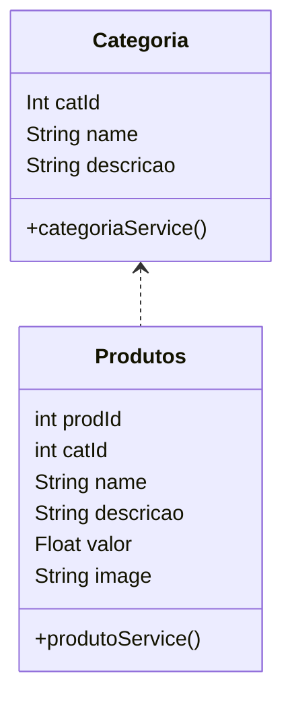

```mermaid
classDiagram

Categoria <.. Produtos

class Produtos {
int prodId
int catId
String name
String descricao
Float valor
String image
+produtoService()
}

class Categoria {
Int catId
String name
String descricao
+categoriaService()
}
```